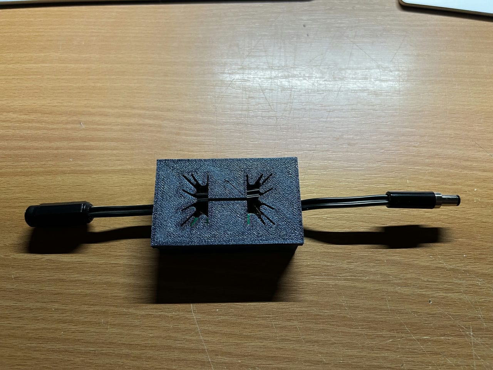
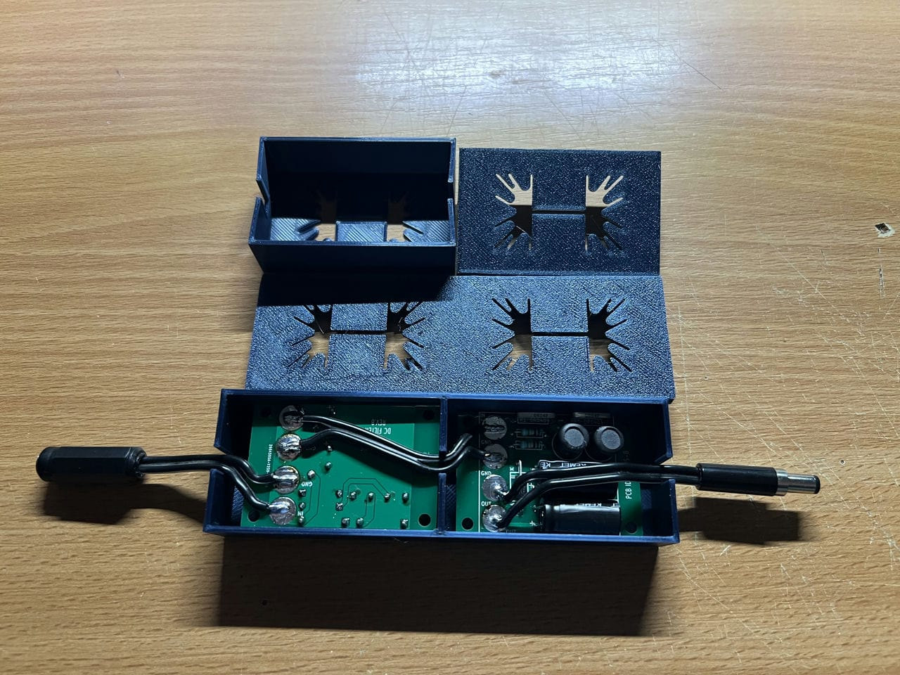

PO89ZB , an inline DC filter for SMPS wall warts . Preamps, HPA, Korg NuTube, etc - Housing

You can use it however you like

Mark Johnson article at diyaudio.com: https://www.diyaudio.com/community/threads/po89zb-an-inline-dc-filter-for-smps-wall-warts-preamps-hpa-korg-nutube-etc.354213/#post-6197841

Now on Makerworld:

single - https://makerworld.com/en/models/666633#profileId-594204

double - https://makerworld.com/en/models/802241#profileId-742352
